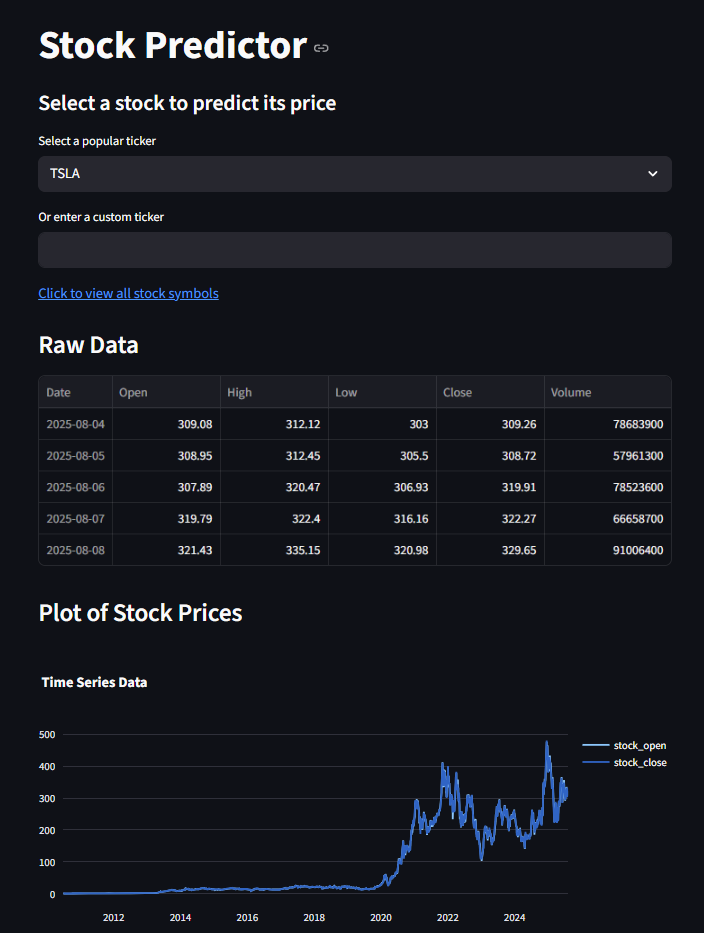

# 📈 Stock Predictor Web App


---

A **Streamlit-based stock prediction app** that lets users forecast stock prices 1–5 years into the future using historical data from Yahoo Finance and the **Facebook Prophet** forecasting model.

**🚀 Live Demo:** [Click to try the app](https://stock-predictor-g6qwwzh9p5ivwutktgmjoq.streamlit.app/)

---

## 🔍 Features
- Select from **popular stock tickers** or enter a **custom ticker**
- View **historical stock data** (Open & Close prices)
- Predict future prices using the **Prophet model**
- **Interactive Plotly charts** for both historical and forecasted prices
- Choose prediction range from **1 to 5 years**

---

## 🚀 How It Works

1. Fetch historical stock price data from Yahoo Finance using `yfinance`.
2. Preprocess and clean the data for modeling.
3. Use Facebook Prophet to forecast future prices based on historical trends.
4. Display interactive charts and forecast results in Streamlit.

---

## 🧠 Tech Stack
- **Python**
- **Streamlit** – Interactive web app framework
- **yFinance** – Yahoo Finance data
- **Prophet** – Time series forecasting
- **Plotly** – Interactive data visualization

---

## 📸 Demo

<p align="center">
  <br>
  <em>Streamlit app interface where you select a ticker (TSLA) to plot the data.</em>
</p>

<p align="center">
  <br>
  <em>Example forecast output showing predicted stock price trends.</em>
</p>

---

## 📦 Installation & Running the App

Follow these steps to get the app running on your local machine.

### 1️⃣ Clone the Repository
```bash
git clone https://github.com/your-username/stock-predictor.git
cd stock-predictor
```

### 2️⃣ Install dependencies 
```bash
pip install -r requirements.txt
```

### 3️⃣ Run the app
```bash
streamlit run app.py
```
